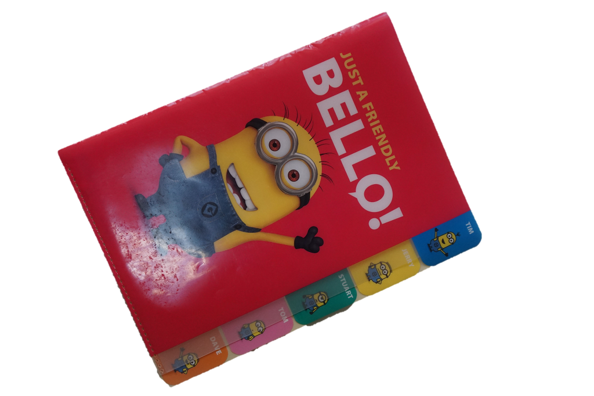
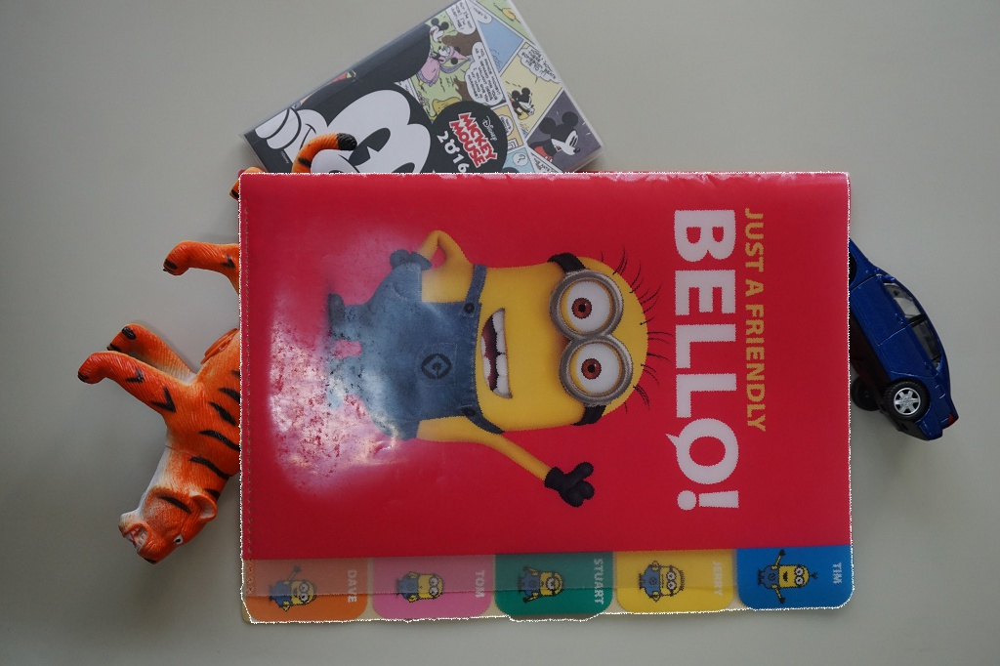

# Object Detect & Image Wrapping
Use SIFT and RANSAC algorithm to detect the object. Then use the recovered Homogrphymatrix to warp the object image to the picture. 

## Introduction

## Demo
target:

object:

result:

